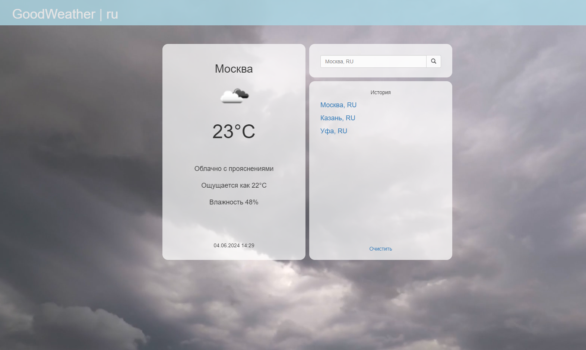

# Weather app

## Overview

This is web-application, which allows you to get the current weather situation in any city.

A full-fledged weather web application with a nice design and the most necessary information.

Application uses Openweathermap API to get current weather. 


## Features

The main functions of the application:
- The ability to search for weather by the name of a city or locality. 
- Display the current weather, including temperature and humidity, as well as visualization on the background.
- Using a database with more than 68,000 cities and towns to accurately determine the user's location.
- The user can choose the language for ease of use - Russian / English.
- Adaptive layout for smartphone screens for easy access to the application from mobile devices.
- Saving history for each individual session, as well as deleting it

## Tech Stack

- **Backend**: Python, Django, SQLite, OpenWeatherMap API, Docker
- **Frontend**: HTML, CSS, Javascript, Django Template Language

## Installation

1. Clone the repository:

    ```bash
    git clone https://github.com/nsstnc/weather.git
    cd weather
    ```

2. Run the setup script to configure the virtual environment and start the project:

    ```bash
    sh setup.sh  # Use `setup.bat` on Windows
    ```


## File Structure
```
weather/  
├── markdown-images/ # Directory for storing documentation images  
├── static/ # Static files folder
├── weather/ # Directory with application settings  
├── weather_app/ # An application with the functionality of main app (it includes templates, static files, main urls and views)  
├── db.sqlite3 # Database  
├── manage.py # The program for launching Django application
├── README.md # Project documentation  
├── requirements.txt # List of dependencies  
├── setup.bat # Script to set up the virtual environment and start the project for Windows systems  
├── setup.sh # Script to set up the virtual environment and start the project for UNIX systems  
```
